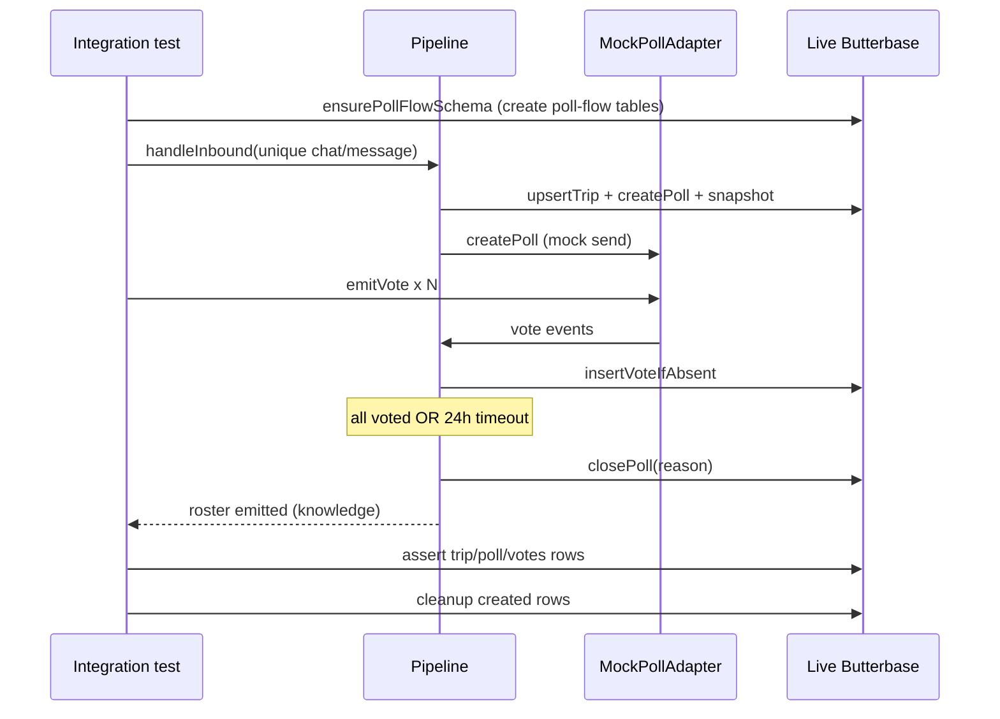

# Butterbase Poll-Flow Integration Test

## Scope (confirmed)
- **In:** Integration test for `intent -> availability poll -> votes -> roster`, persisted to **live Butterbase** (`https://api.butterbase.ai/v1/app_4lls3kxgops9`). Covers both completion triggers: **all voted** (immediate) and **24h timeout** (simulated with a short timeout).
- **In:** A **manual** live script for the real-iMessage path (not an automated test).
- **Out (deferred):** Calendar `POST /api/availability`, `common_free`, the second date-selection poll, and date write-back. None of that exists in code yet (only `docs/contracts/roster-to-calendar-integration.md`).

## Verified facts
- Butterbase creds in `.env` are live (health 200, schema read 200).
- Live app currently has only `participants` + `oauth_tokens`. Poll-flow tables are created on demand by `ensurePollFlowSchema()` in [src/butterbase/api.ts](src/butterbase/api.ts) -> [src/butterbase/schema.ts](src/butterbase/schema.ts). The test must call it in setup.
- Real Photon path already exists: [src/photon/imessage-adapter.real.ts](src/photon/imessage-adapter.real.ts) + [src/photon/adapter-factory.ts](src/photon/adapter-factory.ts), selected by `PHOTON_MODE=real`.
- Pipeline flow + completion logic already implemented in [src/rocketride/pipeline.ts](src/rocketride/pipeline.ts) and [src/rocketride/completion.ts](src/rocketride/completion.ts).

## Test flow

## Implementation

### 1. Add delete support to `ButterbaseClient` (for test cleanup)
In [src/butterbase/api.ts](src/butterbase/api.ts), mirror the existing `patch` / `patchWhere`:
- `delete(table, id)` -> `DELETE /{table}/{id}` (for `trips`, `polls`, `chat_groups` which are id/PK-keyed).
- `deleteWhere(table, query)` -> `DELETE /{table}?{qs}` (best-effort for `poll_votes`, `trip_participants`).

### 2. Integration test: `src/butterbase/poll-flow.integration.test.ts`
Picked up by the default `npm test` (vitest `include: src/**/*.test.ts`), per your choice. Guarded so it degrades gracefully without creds:
- `const hasCreds = !!(config.butterbase.appId && apiKey && baseUrl)` then `describe.skipIf(!hasCreds)`.
- `beforeAll`: build `ButterbaseClient`, `await client.ensurePollFlowSchema()`, wrap in `ButterbaseStore`.
- Use a **unique** `chatGuid` + `messageId` per run (`iMessage;+;it-${randomUUID()}`) to avoid `chat_guid` / `trigger_message_id` / `external_poll_guid` unique-constraint collisions.
- Reuse the passing-classifier + `MockPollAdapter` + `InMemoryKnowledge` patterns from [src/rocketride/pipeline.test.ts](src/rocketride/pipeline.test.ts).

**Scenario A - all voted (complete roster):**
- `seedChat` with 2-3 handles + contact names; `handleInbound`; read `external_poll_guid` from the live `polls` row.
- `emitVote` for every participant; await completion.
- Assert via store/client against live Butterbase: trip row exists; poll row has `external_poll_guid`, `status = "closed"`, `closed_reason = "all_voted"`, persisted `participant_snapshot`; `poll_votes` rows persisted (first-vote-wins); knowledge roster `complete = true` with expected users.

**Scenario B - 24h timeout (partial roster):**
- New unique chat; `completionTimeoutMs = 50` to simulate the 24h timeout deterministically.
- Emit a subset of votes; await timeout.
- Assert poll row `closed_reason = "timeout"`, knowledge roster `complete = false`, only voted users present, votes persisted.

**Cleanup (`afterAll`):** best-effort delete of rows created by the run (poll + trip + chat_group by id; poll_votes + trip_participants via `deleteWhere`), so repeated `npm test` runs don't accumulate junk in the live DB. Errors swallowed.

### 3. Manual real-iMessage live script: `scripts/live-imessage.ts` (+ `npm run live:imessage`)
Mirror [scripts/demo.ts](scripts/demo.ts) but wire the **real** stack for a hands-on run against an actual chat:
- `createPollAdapter()` (set `PHOTON_MODE=real`) + `createStore()` (live Butterbase) + `HeuristicClassifier` + `InMemoryKnowledge`.
- Connect adapter, start pipeline, send a real availability poll to a target `chatGuid` (CLI arg / env), then listen for real votes and persist to Butterbase; roster emitted on all-voted or timeout.
- Requires extra env for the iMessage server (`IMESSAGE_SERVER_URL`, optional `IMESSAGE_API_KEY`) + the optional `@photon-ai/advanced-imessage-kit` dependency on a macOS host. Documented in the script header; no secrets committed.

## Notes / tradeoffs
- Per your choice, the integration test runs in the default `npm test` and makes **real network calls** to Butterbase (slow/needs connectivity). It self-skips without creds. Say the word if you'd rather gate it behind a separate `npm run test:integration`.
- Cleanup defaults to deleting the run's rows. If you'd prefer to leave them in Butterbase to inspect in the dashboard, I'll drop the `afterAll` cleanup.