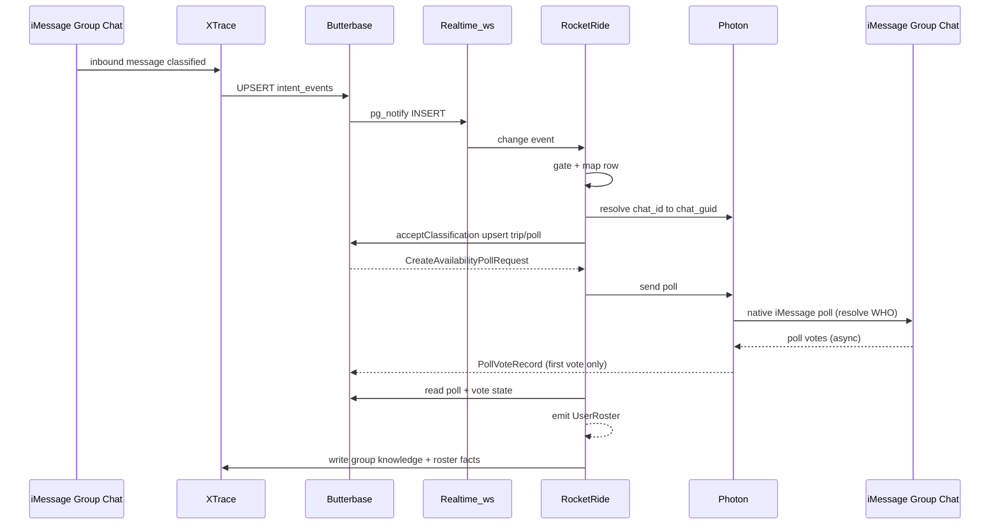

# Integration Contract: Intent Classification → Availability Poll → User Roster

**Status:** Draft  
**Branch:** `feature/photon-imessage-integration-contract`  
**Date:** 2026-06-05  
**Platform:** iMessage only

## Purpose

Define the boundary contract between Reunion's intent layer (XTrace), backend orchestration (RocketRide + Butterbase), and Photon's iMessage layer for the first coordination artifact: a native availability poll sent to the group chat, ending with a structured user roster.

**XTrace classifies and persists intent.** XTrace upserts each classified message to Butterbase as an `IntentEvent` row. A Butterbase realtime INSERT on `intent_events` triggers RocketRide, which maps the row, upserts trip/poll state, and hands Photon a `CreateAvailabilityPollRequest`. Photon sends the native poll that resolves the **WHO** (who is in).

- **WHERE** — destination, resolved by XTrace and stored in `intent_events.location`.
- **WHO** — availability, resolved by the iMessage poll → roster.

**Photon is the iMessage poll connector.** Poll create/vote/parse goes through `@photon-ai/advanced-imessage-kit`. Photon resolves `chat_id` → `chat_guid`, sends polls, and persists votes. Photon does **not** own the canonical intent trigger.

## Integration boundaries (ownership)

The contract is the seam between independently built components. Each owner implements their side and taps in once their part is done:

| Component | Owner role | Responsibility |
|-----------|------------|----------------|
| **XTrace** | Knowledge + intent | Classifies travel intent; **upserts `intent_events`** to Butterbase (canonical WHERE + trigger row); receives terminal roster writeback |
| **Butterbase** | Backend state | Stores `intent_events`, trips, polls, votes; broadcasts INSERT via realtime when enabled |
| **RocketRide** | Backend orchestration | Subscribes to `intent_events` INSERT, applies gate, maps row → poll ingress, drives completion, emits roster |
| **Photon** | iMessage connector | Resolves `chat_id` → `chat_guid`, `sdk.polls.create`, vote persistence via advanced-imessage-kit |

"Backend" = Butterbase state + RocketRide orchestration (+ XTrace knowledge). For poll creation, RocketRide consumes an `IntentEvent` upsert and Photon receives a `CreateAvailabilityPollRequest` back from Butterbase ingress.

## Flow overview



## Step 0 — Input: `IntentEvent` upsert (canonical trigger)

XTrace writes one row per classified message to the live Butterbase `intent_events` table (migration `add_intent_events`).

### `IntentEvent`

```json
{
  "id": "uuid",
  "message_id": "string",
  "channel": "iMessage",
  "chat_id": "string",
  "chat_name": "string | null",
  "chat_kind": "group | dm",
  "sender": "string",
  "is_from_me": false,
  "text": "string",
  "context_window": "string",
  "is_travel_intent": true,
  "confidence": 0.9,
  "location": "string | null",
  "created_at": "ISO-8601"
}
```

### Upsert semantics

- `message_id` is unique (dedup key). XTrace writes one row per classified message.
- Duplicate `message_id` upserts MUST NOT create duplicate polls (`polls.trigger_message_id` dedup).

## Step 0.5 — Event trigger (Butterbase realtime)

Per [Butterbase Realtime](https://docs.butterbase.ai/core-concepts/realtime/):

| Step | Action |
|------|--------|
| Enable | `configure_realtime({ tables: ["intent_events"] })` — installs pg_notify DB triggers |
| Subscribe | RocketRide connects to `wss://api.butterbase.ai/v1/{app_id}/realtime` with service key |
| Subscribe msg | `{ "type": "subscribe", "table": "intent_events" }` |
| Handler | On `{ "type": "change", "op": "INSERT", "table": "intent_events" }`, process `record` |
| Reconnect | Re-fetch recent rows: `GET /intent_events?is_travel_intent=eq.true&order=created_at.desc` (events may be lost during LISTEN reconnection) |

Optional filter subscription: `{ "type": "subscribe", "table": "intent_events", "filter": { "is_travel_intent": true } }`.

## Step 1 — Gate + map `IntentEvent`

RocketRide applies the gate on the raw `IntentEvent` before mapping. Rows that fail are dropped with `intent.gate_failed`.

### Gate rules (`IntentEvent`)

| Rule | Field | Value |
|------|-------|-------|
| Travel detected | `is_travel_intent` | `true` |
| Confidence | `confidence` | ≥ `0.6` (tunable via `INTENT_CONFIDENCE_THRESHOLD`) |
| Platform | `channel` | `iMessage` (case-insensitive → `imessage`) |
| Chat present | `chat_id` | non-empty |
| Dedup | `message_id` | must not already exist in `polls.trigger_message_id` |
| Ignore poll echoes | `text` | MUST NOT match poll title/options (e.g. `Can everyone make this trip?` with `• Yes` / `• No`) |

### Field mapping: `IntentEvent` → `IntentClassificationResult`

RocketRide normalizes before calling `IntentIngressService.acceptClassification()`:

| `IntentEvent` | `IntentClassificationResult` |
|---------------|------------------------------|
| `message_id` | `message_id`, `context.trigger_message_id` |
| `channel` | `platform: "imessage"` |
| resolved `chat_guid` | `chat_guid` (from `chat_id` — see Step 1.5) |
| `text` | `text` |
| `created_at` | `classified_at` |
| `is_travel_intent` | `travel_intent.detected` |
| `confidence` | `travel_intent.confidence` |
| `location` | `extracted.destination` |
| — | `extracted.timeframe: null` (not in live schema) |
| — | `travel_intent.signal: "mixed"` (default until XTrace adds it) |
| — | `should_orchestrate: true` when gate passes |

### Internal `IntentClassificationResult` (normalized shape)

```json
{
  "message_id": "string",
  "chat_guid": "string",
  "platform": "imessage",
  "text": "string",
  "classified_at": "ISO-8601",
  "travel_intent": {
    "detected": true,
    "confidence": 0.0,
    "signal": "explicit_planning | destination_mention | date_mention | mixed"
  },
  "extracted": {
    "destination": "string | null",
    "timeframe": "string | null",
    "participants_mentioned": ["string"]
  },
  "should_orchestrate": true
}
```

## Step 1.5 — Chat resolution (`chat_id` → `chat_guid`)

Live `intent_events.chat_id` is an XTrace identifier (hash), not an advanced-imessage-kit `chat_guid` (`iMessage;+;...`). Photon MUST resolve before `sdk.polls.create`:

1. If `chat_id` already matches `iMessage;` prefix, use as `chat_guid` directly.
2. `sdk.chats.getChats()` filtered by `chat_name` + `chat_kind=group`, **or**
3. Local Messages DB lookup by name (`resolveGroupChatGuidByName`).

On failure, emit `CHAT_RESOLUTION_FAILED` and abort poll creation.

## Step 2 — Action: Create availability poll (resolve WHO)

RocketRide calls Butterbase ingress with the mapped `IntentClassificationResult`. Butterbase upserts trip/group/poll context and returns a `CreateAvailabilityPollRequest`. Photon sends the native poll.

### `CreateAvailabilityPollRequest`

```json
{
  "correlation_id": "uuid",
  "trip_id": "uuid | null",
  "target": {
    "chat_guid": "string",
    "platform": "imessage"
  },
  "poll": {
    "title": "Can everyone make this trip?",
    "options": ["Yes", "No"],
    "kind": "availability"
  },
  "context": {
    "destination": "string | null",
    "timeframe": "string | null",
    "trigger_message_id": "string"
  }
}
```

### Poll semantics

| Option | Meaning |
|--------|---------|
| **Yes** | Participant is in for the trip |
| **No** | Participant cannot make it |

### iMessage adapter

```typescript
import { SDK } from "@photon-ai/advanced-imessage-kit";

const poll = await sdk.polls.create({
  chatGuid: request.target.chat_guid,
  title: request.poll.title,
  options: request.poll.options,
});
```

### `CreateAvailabilityPollResponse`

```json
{
  "correlation_id": "uuid",
  "poll_id": "uuid",
  "external_poll_guid": "string",
  "status": "sent | failed",
  "sent_at": "ISO-8601",
  "error": "string | null"
}
```

`external_poll_guid` maps to `poll.guid` from `sdk.polls.create`.

### Participant snapshot

At poll creation, capture the target group's participant set via `sdk.chats.getChats()` → `participants` and persist it alongside the poll. This snapshot is the denominator for completion ("all voted") and for the pending set in a partial roster.

## Step 3 — Async: Collect votes

The iMessage adapter listens on `sdk.on('new-message')` and normalizes poll vote events.

```typescript
import {
  isPollMessage,
  isPollVote,
  parsePollVotes,
  getOptionTextById,
} from "@photon-ai/advanced-imessage-kit";

sdk.on("new-message", (message) => {
  if (!isPollMessage(message) || !isPollVote(message)) return;
  const vote = parsePollVotes(message);
  // normalize to PollVoteRecord, then apply first-vote-wins (see below)
});
```

### Vote uniqueness (v1: first-vote-wins)

A participant's **first** vote on a poll is persisted; subsequent votes for the same `(poll_id, participant_handle)` are **ignored** (no rewrites in v1). iMessage allows changing a vote, but v1 deliberately does not track revisions. Implement as insert-if-absent on `(poll_id, participant_handle)`; emit `vote.ignored` for later votes.

### iMessage vote event (native)

```json
{
  "event": "poll_vote",
  "poll_message_guid": "string",
  "chat_guid": "string",
  "votes": [
    {
      "participant_handle": "+14155551234",
      "option_identifier": "string",
      "option_text": "Yes"
    }
  ]
}
```

Votes are **persisted on each event**; the roster is **not** emitted per vote.

### Normalized `PollVoteRecord`

```json
{
  "poll_id": "uuid",
  "participant_handle": "string",
  "option_identifier": "string",
  "option_text": "Yes | No",
  "voted_at": "ISO-8601"
}
```

`option_identifier` is retained as the stable key from the native event; `option_text` is the human-readable label resolved via `getOptionTextById`.

### Completion trigger (v1)

Close the poll and emit `UserRoster` when either:

- **All voted** — every participant in the snapshot has cast a vote → close immediately, or
- **24h timeout** — default `COMPLETION_TIMEOUT_MS=86400000` → close with partial roster (`complete: false`)

Individual votes are saved as they arrive; the roster is emitted **once** on close.

## Step 4 — Output: User roster (terminal artifact)

The flow **ends** by emitting a `UserRoster` JSON object. This is the knowledge handoff: roster facts and group context are written to **XTrace**, while poll/trip/vote **state** lives in Butterbase.

### `UserRoster`

```json
{
  "correlation_id": "uuid",
  "trip_id": "uuid",
  "poll_id": "uuid",
  "generated_at": "ISO-8601",
  "complete": true,
  "users": [
    {
      "name": "Alice Chen",
      "phone_number": "+14155551234",
      "availability": "yes"
    },
    {
      "name": "Bob Martinez",
      "phone_number": "+14155559876",
      "availability": "no"
    }
  ]
}
```

`complete` is `true` when every participant in the snapshot voted; `false` when the roster is emitted on timeout (see `PARTIAL_ROSTER`).

### `User` field rules

| Field | Type | Source | Required |
|-------|------|--------|----------|
| `name` | `string` | Contacts lookup via `nameMap.get(handle)` (built from `sdk.contacts.getContacts()`); fallback to `participant_handle` | Yes |
| `phone_number` | `string` | E.164 from `participant_handle` | Yes |
| `availability` | `"yes" \| "no"` | The participant's persisted (first) vote `option_text`, lowercased | Yes |

### Inclusion rules

A user appears in `users` when:

1. They are a participant in the target iMessage group chat, **and**
2. They cast a vote on the availability poll (`Yes` or `No`).

Their `availability` carries the actual vote, so downstream consumers (not this contract) decide who is "in." Non-voters are excluded from the roster but may be tracked separately in Butterbase as `TripParticipant.status = "pending"`.

### Name resolution algorithm

```
contacts = sdk.contacts.getContacts()
nameMap = {}
for each c in contacts:
  name = c.displayName ?? c.firstName ?? ""
  for each address in (c.phoneNumbers + c.emails):
    if name: nameMap[address] = name

for each voted participant_handle:
  name = nameMap[handle] ?? handle
  phone_number = normalizeE164(handle)
  availability = lowercase(first_vote.option_text)
  append { name, phone_number, availability }
```

## Error contract

| Error code | Condition | Behavior |
|------------|-----------|----------|
| `INTENT_GATE_FAILED` | `IntentEvent` below threshold or poll echo | Drop row, log `intent.gate_failed` |
| `CHAT_RESOLUTION_FAILED` | `chat_id` cannot map to `chat_guid` | Fail fast, log |
| `MISSING_CHAT_GUID` | Resolved `chat_guid` absent or invalid | Fail fast, log |
| `POLL_SEND_FAILED` | `sdk.polls.create` error | Retry 2x, then surface to chat |
| `PARTIAL_ROSTER` | Timeout with <100% votes | Emit roster with voted users only; set `complete: false` |

Vote changes are not an error: a later vote for an already-voted `(poll_id, participant_handle)` is silently dropped and logged as `vote.ignored`.

## Idempotency

- `correlation_id` is generated once per intent-triggered poll.
- **Poll-creation dedup key:** `trigger_message_id` (= `intent_events.message_id`). Duplicate upserts for the same `message_id` MUST NOT create duplicate polls.
- When `trip_id` is null, dedup additionally on `(chat_guid, poll.kind)` so the first availability poll for a chat isn't duplicated before a trip exists.
- Butterbase stores a `(trip_id, poll.kind)` unique constraint for `availability` once `trip_id` is assigned.
- **Vote dedup:** first vote per `(poll_id, participant_handle)` wins (see Step 3).

## Observability (demo / judges)

Pipeline stages should log:

1. `intent.upserted` — XTrace writes `intent_events` (XTrace-side)
2. `intent.received` — RocketRide gets realtime INSERT
3. `intent.mapped` — row normalized + chat resolved
4. `intent.gate_failed` — below threshold or poll echo
5. `poll.requested` — `chat_guid` + options
6. `poll.sent` — `external_poll_guid`
7. `poll.vote.received` — per `participant_handle`
8. `vote.ignored` — duplicate vote dropped (first-vote-wins)
9. `roster.emitted` — final `users` array + `complete`
10. `knowledge.written` — roster + group context persisted to XTrace

## Resolved decisions

1. **Intent trigger** — XTrace upserts `intent_events` to Butterbase; realtime INSERT is the canonical poll-creation trigger.
2. **Poll path** — RocketRide maps + gates → Butterbase ingress → Photon `sdk.polls.create`; votes via advanced-imessage-kit.
3. **Poll options** — `Yes` / `No` only (no `Maybe`).
4. **Vote changes** — first-vote-wins in v1; no revisions tracked.
5. **Poll close** — all voted (immediate) or 24h timeout; roster emitted once on close.
6. **State persistence** — trip/poll/vote state in Butterbase when credentials configured (`src/butterbase/butterbase-store.ts`).

## Open decisions

1. **Non-voter representation in XTrace** — omit (current) vs record as `status: "pending"` knowledge.
2. **`travel_intent.signal` on `IntentEvent`** — default `mixed` until XTrace adds an explicit field.

## Appendix — Legacy: Photon direct ingress (non-canonical)

For monolithic dev, integration tests, and demos without XTrace realtime:

- Photon receives inbound iMessage via Spectrum webhook/listener.
- On-device `HeuristicClassifier` (stand-in for CoreML/Swift) produces `IntentClassificationResult`.
- Photon POSTs to `POST /butterbase/intent-classified` (split deploy) or calls ingress in-process.
- Same poll send + vote path as above.

This path is **not** the production trigger. See `src/photon/connector.ts` (`handleInbound`) and `src/butterbase/routes.ts`.

## Related docs

- `docs/connections/butterbase.md` — `intent_events` table + realtime requirement
- `docs/connections/imessage.md`
- `docs/connections/photon-spectrum.md` — Spectrum iMessage provider (legacy inbound)
- `docs/PRD.md` — FR1, FR5, FR6
- `ADR/ADR-005` — XTrace memory vs Butterbase state
- `ADR/ADR-013` — RocketRide orchestration
