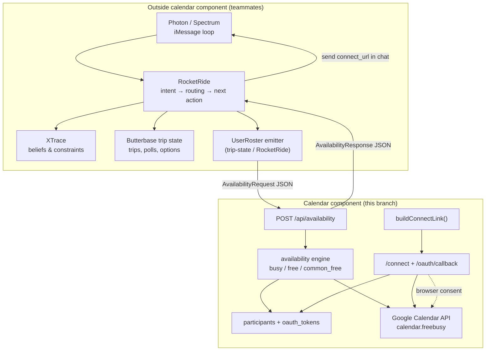
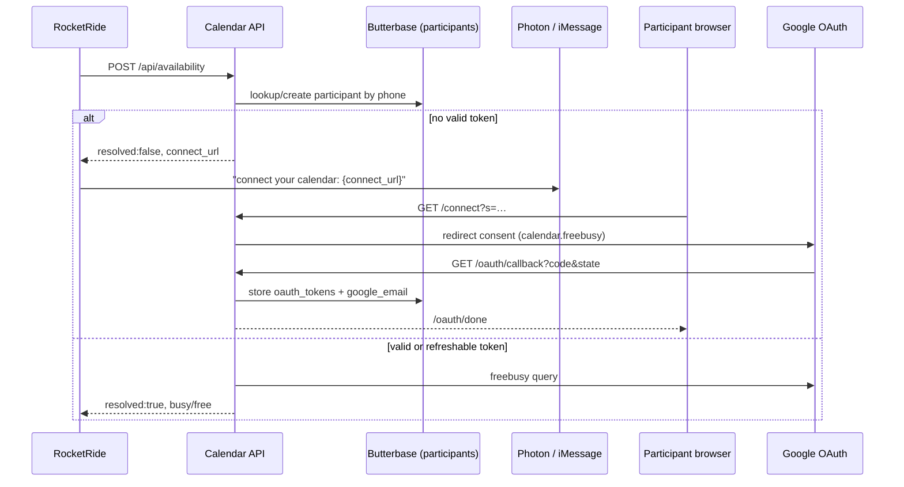

# Roster → Calendar integration contract

Boundary document between the **calendar component** (`feat/calendar-component`) and the
rest of Reunion (Photon/Spectrum, RocketRide, XTrace, trip-state in Butterbase).

Canonical I/O shapes live in [`INTERFACE.md`](../../INTERFACE.md). V1 scope in
[`SCOPE_NOTES.md`](../../SCOPE_NOTES.md).

## System boundary



## Ownership table

| Concern | Owner | Notes |
| --- | --- | --- |
| iMessage ingest/send | Photon / Spectrum | Calendar never talks to `chat.db` |
| Travel intent, entity extraction, path routing | RocketRide | Calendar is not invoked on every message |
| Person/group beliefs (diet, budget, prefs) | XTrace | Calendar does not read or write XTrace |
| Trip rows, polls, plan artifacts | Butterbase (trip-state) | Calendar only owns `participants` + `oauth_tokens` tables |
| **When** to ask for availability | RocketRide / trip-state | Calendar does not decide timing |
| **UserRoster** assembly (phones + window) | RocketRide or trip-state | Emits the availability request |
| OAuth consent UX | Calendar (`/connect`, `/oauth/callback`) | Browser-only; not in iMessage |
| Token storage & refresh | Calendar | Keyed by `participant_id` |
| freebusy query + interval math | Calendar | `busy`, `free`, `common_free` |
| Sending `connect_url` to unresolved users | RocketRide / Photon | Calendar **returns** URLs; does not send them |
| Plaintext availability fallback | Calendar accepts; upstream may supply | Shape TBD; presence of `plaintext` marks resolved |

## Upstream: `UserRoster` → calendar input

RocketRide / trip-state owns a roster object when dates need resolving (time-known or
open-ended paths). Calendar receives a **normalized request** — not the full roster graph.

### Expected upstream shape (illustrative)

```ts
// Owned by trip-state / RocketRide — NOT implemented in calendar branch
interface UserRoster {
  trip_id: string;
  window: { start: string; end: string }; // candidate dates
  members: Array<{
    phone: string;           // required — sole join key calendar receives
    display_name?: string;   // ignored by calendar
    plaintext_availability?: unknown; // optional fallback
  }>;
}
```

### Mapping to `POST /api/availability`

| `UserRoster` field | Calendar input field | Transform |
| --- | --- | --- |
| `trip_id` | `trip_id` | pass through |
| `window` | `window` | pass through (`YYYY-MM-DD` or ISO) |
| `members[].phone` | `participants[].phone` | one entry per member |
| `members[].plaintext_availability` | `participants[].plaintext` | optional; tags `source: "plaintext"` |

```json
{
  "trip_id": "abc-123",
  "window": { "start": "2026-07-10", "end": "2026-07-20" },
  "participants": [
    { "phone": "+15551234567" },
    { "phone": "+15559876543", "plaintext": "free July 14–16" }
  ]
}
```

### Transport (default)

- **Method:** `POST /api/availability`
- **Auth:** `x-internal-key: $INTERNAL_API_KEY` (shared secret)
- **Response:** `AvailabilityResponse` JSON (see [`INTERFACE.md`](../../INTERFACE.md#output))

Alternative transports (Butterbase row, file drop) are out of scope until agreed with
RocketRide owner. Calendar always **produces** the response object; delivery is upstream.

## Downstream: calendar output → planning

| Output field | Consumer | Use |
| --- | --- | --- |
| `participants[].resolved` | RocketRide | Skip or chase connect for unresolved |
| `participants[].connect_url` | Photon | Send link in iMessage for `needs_connect_link` |
| `participants[].busy` / `free` | RocketRide, XTrace | Per-person facts; may write `availability.*` beliefs |
| `common_free` | RocketRide, trip-state | Drive date poll options / next action |
| `window` | pass-through | Echo for idempotency |

### Unresolved participant policy (confirm with teammates)

V1 computes `common_free` over **resolved participants only**. Open question: does one
unresolved member block proposing dates, or are they excluded with a nudge to connect?
Calendar exposes both states; RocketRide decides policy.

## Connect-link handoff



Calendar owns `buildConnectLink(tripId, participantId)`. Upstream may call the helper
directly or rely on `connect_url` in the availability response.

## Files inside the boundary

```
app/connect/route.ts
app/oauth/callback/route.ts
app/oauth/done/page.tsx
app/api/availability/route.ts
lib/config.ts
lib/state.ts
lib/connect-link.ts
lib/google.ts
lib/storage.ts          # participants + oauth_tokens only
lib/availability.ts
lib/butterbase.ts       # storage adapter helper
scripts/seed-connect-link.mts
scripts/provision-butterbase.mts
```

## Explicitly outside the boundary

Do **not** add to this branch:

- `src/photon/*` — iMessage adapters (Photon teammate)
- RocketRide pipeline, intent classifier, path router
- XTrace read/write
- Trip/poll/option Butterbase schema beyond participant token tables
- Chat reply generation
- Movability / event-title classification (V2 — see `SCOPE_NOTES.md`)

## V1 constraints (frozen)

- Google Calendar only; scope `calendar.freebusy` (no event titles)
- Testing-mode OAuth with `ALLOWED_TEST_EMAILS` allowlist
- Phone is the only participant identifier crossing the seam
- Returning users with stored tokens: silent — no connect link, no browser step
